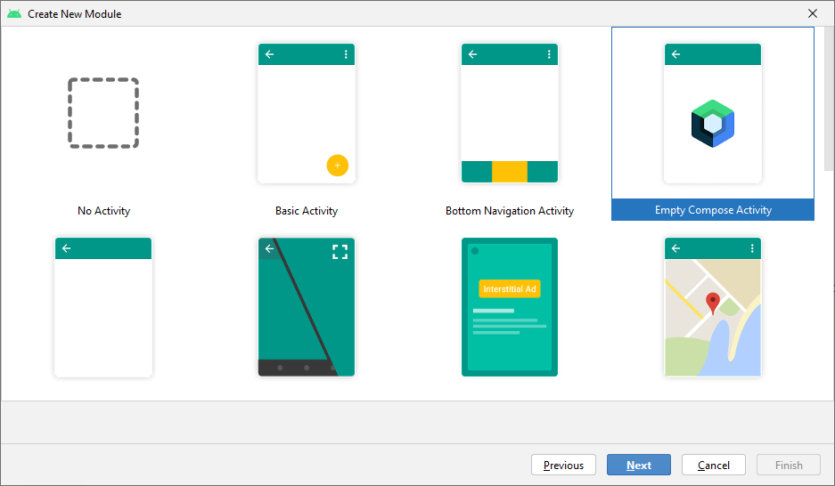

### [Back to tutorials list](README.md)

# 1. Project setup

Let's start by creating a new project. Please make sure you chose `Empty Compose Activity` template like in the image below.



In root project's `build.gradle` change the compose and kotlin plugins versions to the ones matching the versions found in  
[Libs.kt](../../buildSrc/src/main/java/com/adamkobus/compose/navigation/Libs.kt) and add [Hilt](https://developer.android.com/training/dependency-injection/hilt-android)

After those changes, root `build.gradle` should look similar to this:

> `/build.gradle`
```groovy
buildscript {
    ext {
        compose_version = '1.1.0-rc01'
        hilt_version = "2.40.5"
        android_plugin_version = "7.1.0"
    }
    dependencies {
        classpath "com.google.dagger:hilt-android-gradle-plugin:$hilt_version"
    }
}// Top-level build file where you can add configuration options common to all sub-projects/modules.
plugins {
    id 'com.android.application' version "$android_plugin_version" apply false
    id 'com.android.library' version "$android_plugin_version" apply false
    id 'org.jetbrains.kotlin.android' version '1.6.0' apply false
}

task clean(type: Delete) {
    delete rootProject.buildDir
}
```

Now in `app/build.gradle` add plugins and dependencies:

> `/app/build.gradle`
```groovy

plugins {
    id 'com.android.application'
    id 'org.jetbrains.kotlin.android'  
    id 'kotlin-kapt' // needed for hilt
    id 'dagger.hilt.android.plugin' 
}

android {
    (...)
}


dependencies {
    implementation "com.adamkobus:compose-navigation:0.2.0" // change to actual version you want to use.
    implementation "com.google.accompanist:accompanist-navigation-animation:0.22.0-rc"
    implementation "androidx.hilt:hilt-navigation-compose:1.0.0"
    implementation "com.google.dagger:hilt-android:$hilt_version"
    kapt "com.google.dagger:hilt-compiler:$hilt_version"

    (...) // remaining dependencies are left unchanged
}

```

Synchronize the Gradle configuration and build the app, it should launch without issues.

Next we will configure Hilt so that we can use it in the rest of the examples. To do this, create a file `TutorialApplication.kt` in the same package as `MainActivity.kt` and put this code in it:

> `.TutorialApplication.kt`
```kotlin
import android.app.Application
import dagger.hilt.android.HiltAndroidApp

@HiltAndroidApp
class TutorialApplication : Application()
```

Remember to register `TutorialApplication` in `AndroidManifest.xml` by adding:

> `/app/src/main/AndroidManifest.xml`
```xml
    <application
        android:name=".TutorialApplication"
```

Since we are using Hilt, we can provide `NavigationConsumer` using it. To do that, add `NavigationModule` class in `.nav` package:

> `.nav.NavigationModule.kt`
```kotlin
@InstallIn(SingletonComponent::class)
@Module
object NavigationModule {

    @Provides
    fun providesNavigationConsumer(): NavigationConsumer = ComposeNavigation.getNavigationConsumer()
}
```

The last thing to do before we can jump into creating screens, is registering `MainActivity` as an entry point for Hilt:

> `.MainActivity.kt`
```kotlin
import dagger.hilt.android.AndroidEntryPoint

@AndroidEntryPoint
class MainActivity : ComponentActivity() {
```

Now that Hilt is configured and dependencies are in place, we can start adding actual screens and navigation.

### Next: [2. Displaying your first screen with NavGraph](02_first_graph.md)

### [Back to tutorials list](README.md)
