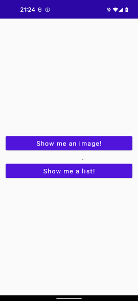

### [Back to tutorials list](README.md)

# 2. Displaying your first screen with [NavGraph]

We will start by creating a `WelcomeScreen` composable and its `ViewModel` in `.ui.welcome` package:

> `.ui.welcome.WelcomeScreen.kt`
```kotlin
@Composable
fun WelcomeScreen() {
    val vm: WelcomeScreenVM = hiltViewModel()
    WelcomeScreenContent(interactions = vm.interactions)
}

@Composable
private fun WelcomeScreenContent(interactions: WelcomeScreenInteractions = WelcomeScreenInteractions.STUB) {
    Column(
        modifier=Modifier.padding(16.dp),
        verticalArrangement = Arrangement.Center
    ) {
        Button(onClick = interactions.onShowImageClicked, modifier = Modifier.fillMaxWidth()) {
            Text(text = "Show me an image!")
        }
        Spacer(modifier = Modifier.height(30.dp))
        Button(onClick = interactions.onShowListClicked, modifier = Modifier.fillMaxWidth()) {
            Text(text = "Show me a list!")
        }
    }
}

@Preview
@Composable
private fun WelcomeScreenPreview() {
    WelcomeScreenContent()
}

@HiltViewModel
class WelcomeScreenVM @Inject constructor() : ViewModel() {
    val interactions = WelcomeScreenInteractions(
        onShowImageClicked = {
            // TODO
        },
        onShowListClicked = {
            // TODO
        },
    )
}

data class WelcomeScreenInteractions(
    val onShowImageClicked: () -> Unit,
    val onShowListClicked: () -> Unit
) {
    companion object {
        val STUB = WelcomeScreenInteractions(
            onShowImageClicked = {},
            onShowListClicked = {}
        )
    }
}
```

`WelcomeScreenPreview` should render two buttons stacked one above the other if all went well. 
We will use those buttons later for navigation.

For now we will focus on displaying the screen we just created. 
To do that, create `.nav` package and put `TutorialGraph.kt` in it with following content:

> `.nav.TutorialGraph.kt`
```kotlin
import com.adamkobus.compose.navigation.data.NavGraph

object TutorialGraph : NavGraph("tutorialGraph") { // 1
    override fun startDestination() = Welcome // 2

    val Welcome = navDestination("welcome") // 3
}
```

1. Each graph must have its name. Keep those unique across your project, as it acts as an ID of a graph.
2. Graphs must have starting points. It can be either a destination or another graph
3. We declared a new destination in the app. Ideally, every screen in your app should have its own destination declared like this

You could use those definitions to declare Jetpack's navigation graph directly in `NavHost`, 
but I recommend doing this through an extension, as it makes the `NavHost` easier to read.

For the graph above, an extension would look like this:

> `nav.TutorialGraph.kt`
```kotlin
@ExperimentalAnimationApi // 1
fun NavGraphBuilder.tutorialGraph() {
    composableNavigation(TutorialGraph) { // 2
        composableDestination(TutorialGraph.Welcome) {
            WelcomeScreen()
        }
    }
}
```

1. `@ExperimentalAnimationApi` is required because Compose Navigation is using [Accompanist Navigation Animation]
2. `composableNavigation` is a function from Compose Navigation library and it's used to define a graph inside `NavGraphBuilder`
3. `composableDestination` is another function from Compose Navigation. It declares new destination in `NavGraphBuilder`

All that's left now putting it all together in `MainActivity`. Replace the content inside your theme with:

> `.MainActivity.kt`
```kotlin
                val navHostController = rememberAnimatedNavController() // 1.
                NavComposable(navController = navHostController) // 2.

                AnimatedNavHost(
                    navController = navHostController,
                    startDestination = TutorialGraph.name, // 3.
                    modifier = Modifier.fillMaxSize()
                ) {
                    tutorialGraph() // 4.
                }
```

1. `rememberAnimatedNavController()` is part of [Accompanist Navigation Animation]
2. This is a component from Compose Navigation library. 
   Its purpose is to consume pending navigation actions and deliver them to `navHostController`
3. startDestination of controller determines where the user will land at the application launch. 
4. We're using the extension we wrote earlier to declare a navigation graph inside `NavHost`

Now just launch the app and marvel at the beauty of what we created:



### Next: [3. Navigation basics using NavAction](03_navigation_basics.md)

### [Back to tutorials list](README.md)

[Accompanist Navigation Animation]: https://google.github.io/accompanist/navigation-animation/

<!-- GENERATED SECTION - DON'T ADD ANY TEXT BELOW THIS TAG -->

[NavGraph]: ../../docs/components/composenav/composenav/com.adamkobus.compose.navigation.data/-nav-graph/index.md
