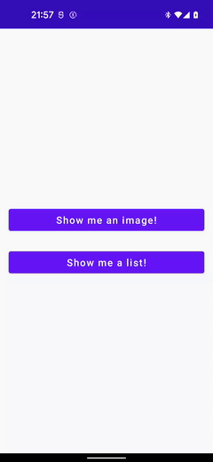

### [Back to tutorials list](README.md)

# 3. Navigation basics using NavAction

We displayed a screen with two buttons in the [previous step](02_first_graph.md) of this tutorial. In this step we wil actually make those buttons do stuff.

Let's start by declaring two addictional screens:

> `.ui.imagescreen.ImageScreen.kt`:
```kotlin
@Composable
fun ImageScreen() {
    Box(modifier = Modifier.fillMaxSize().padding(16.dp)) {
        Icon(
            imageVector = Icons.Filled.ThumbUp,
            contentDescription = "app icon",
            modifier = Modifier.align(Alignment.CenterEnd)
        )
    }
}
```

> `.ui.imagescreen.ListScreen.kt`:
```kotlin
@Composable
fun ListScreen() {
    val vm: ListScreenVM = hiltViewModel()
    LazyColumn(
        modifier = Modifier.fillMaxSize(),
        contentPadding = PaddingValues(16.dp),
        verticalArrangement = Arrangement.spacedBy(10.dp)
    ) {
        items(vm.listContent.value, key = { it.id }) { itemData ->
            ListElement(itemData, vm.interactions.onItemSelected)
        }
    }
}

@Composable
private fun ListElement(data: ListItemData, onItemClicked: (ListItemData) -> Unit) {
    Card(modifier = Modifier
        .fillMaxWidth()
        .clickable { onItemClicked(data) }
    ) {
        Text(text = data.title, modifier = Modifier.padding(14.dp))
    }
}

@HiltViewModel
class ListScreenVM @Inject constructor() : ViewModel() {
    val listContent = mutableStateOf(
        // will generate 50 list elements numbered from 1 to 50
        generateSequence(1) { it + 1 }.take(50).map { ListItemData(it, "List item #$it") }.toList()
    )
    val interactions = ListScreenInteractions(
        onItemSelected = {
            // TODO
        }
    )
}

data class ListScreenInteractions(
    val onItemSelected: (ListItemData) -> Unit
)

data class ListItemData(
    val id: Int,
    val title: String
)
```

Now we need to declare destinations for those 2 screens and update `tutorialGraph()` extension:

> `.nav.TutorialGraph.kt`
```kotlin
object TutorialGraph : NavGraph("tutorialGraph") {
    override fun startDestination() = Welcome

    val Welcome = navDestination("welcome")
    val Image = navDestination("image")
    val List = navDestination("list")
}

@ExperimentalAnimationApi
fun NavGraphBuilder.tutorialGraph() {
    composableNavigation(TutorialGraph) {
        composableDestination(TutorialGraph.Welcome) {
            WelcomeScreen()
        }
        composableDestination(TutorialGraph.Image) {
            ImageScreen()
        }
        composableDestination(TutorialGraph.List) {
            ListScreen()
        }
    }
}
```

With new destinations in place we can start adding navigation actions. Let's define them in `.nav.TutorialNavActions` file like this:

> `.nav.TutorialNavActions.kt`
```kotlin
object TutorialNavActions {
    val FromWelcomeToImage = TutorialGraph.Welcome goTo TutorialGraph.Image
    val FromWelcomeToList = TutorialGraph.Welcome goTo TutorialGraph.List
}
```

The format used above should be quite obvious. If you inspect `FromWelcomeToImage` or `FromWelcomeToList` you will see that `INavDestination.goTo(INavDestination)` created new `NavigateAction`. We can use it now in `WelcomeScreenVM` to perform the actual navigation:

> `.ui.welcome.WelcomeScreen.kt`
```kotlin
@HiltViewModel
class WelcomeScreenVM @Inject constructor(
    val navigationConsumer: NavigationConsumer // 1.
) : ViewModel() {
    val interactions = WelcomeScreenInteractions(
        onShowImageClicked = {
            navigationConsumer.offer(TutorialNavActions.FromWelcomeToImage)
        },
        onShowListClicked = {
            navigationConsumer.offer(TutorialNavActions.FromWelcomeToList)
        },
    )
}
```

1. This is a util from Compose Navigation library. Its purpose is to queue offered actions and intents for further processing.

Now just launch the app and see the effect for yourself. You should be able to launch `ImageScreen` and `ListScren` by clicking the buttons.

One thing you might've noticed is that double clicking the "Show me an image!" button opens the `ImageScreen` twice. 

This can be prevented using `launchSingleTop = true` option like below:

> `.nav.TutorialNavActions.kt`
```kotlin
object TutorialNavActions {
    val FromWelcomeToImage = TutorialGraph.Welcome goTo TutorialGraph.Image navigate {
        launchSingleTop = true
    }
    val FromWelcomeToList = TutorialGraph.Welcome goTo TutorialGraph.List navigate {
        launchSingleTop = true
    }
}
```

This is not always an optimal solution though, as in some apps it's perfectly fine to open same kind of destination twice, but with different param. 

Also, this doesn't solve different issue. If you hold both buttons and release them at the same time, then both `ImageScreen` and `ListScreen` will be put into back stack:



This is something that `launchSingleTop = true` cannot fix, but I think that you already suspect that this is something Compose Navigation can help you deal with.

> and that would be a correct assumption

### Next: [4. Preventing navigation from happening with NavActionVerifier](04_nav_verifier.md)

### [Back to tutorials list](README.md)
