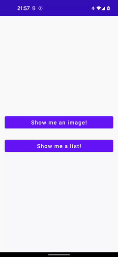

### [Back to tutorials list](README.md)

# 4. Preventing navigation from happening with [NavActionVerifier]

In the [previous step](03_navigation_basics.md) we created an application that has 2 buttons, each opening a different screen. 
The problem to be solved now is how to prevent both screens from opening at once if the user clicks both buttons at the same time:



Compose Navigation library main purpose was to provide tools to control navigation and make it more predictable. 
One of those tools is [NavActionVerifier].

This interface comes with only one method:
```kotlin
fun isNavActionAllowed(navState: NavState, action: NavAction): VerifyResult
```

[VerifyResult] is an enum with `Allow` and `Discard` values. If this is not already obvious, 
implementations of [NavActionVerifier] should analyze the current state of the navigation 
in the context of the processed `action` and return whether the `action` should be `Allow`ed to be processed or `Discard`ed.

The simplest verifier you can make is the one that compares the `currentDestination.destination` with the [NavAction.fromDestination] 
and discards the action if those destinations don't match.

Let's do that by creating `TutorialNavActionVerifier` in `.nav` package and registering it in [ComposeNavigation] in the app's `onCreate`:

> `.nav.TutorialNavActionVerifier.kt`:
```kotlin
import com.adamkobus.compose.navigation.NavActionVerifier
import com.adamkobus.compose.navigation.VerifyResult
import com.adamkobus.compose.navigation.action.NavAction
import com.adamkobus.compose.navigation.destination.GlobalGraph
import com.adamkobus.compose.navigation.destination.NavState

object TutorialNavActionVerifier : NavActionVerifier {
    override fun isNavActionAllowed(navState: NavState, action: NavAction): VerifyResult {
        if (action.fromDestination.graph == GlobalGraph) return VerifyResult.Allow // 1.
        return if (navState.isCurrent(action.fromDestination)) { // 2.
            VerifyResult.Allow
        } else {
            VerifyResult.Discard
        }
    }
}
```

> `.TutorialApplication.kt`:
```kotlin
import com.adamkobus.compose.navigation.ComposeNavigation

@HiltAndroidApp
class TutorialApplication : Application() {
    override fun onCreate() {
        super.onCreate()
        ComposeNavigation
            .addNavActionVerifiers(TutorialNavActionVerifier)
    }
}
```

1. It's good idea to exclude actions originating from [GlobalGraph] from such check. 
   Overall, using [GlobalGraph] should be avoided exactly because it makes navigation unpredictable. 
   Instead I recommend using [NavIntent]s which are covered later in this tutorial.
2. The actual check is happening here. The way it resolves the issue described in the intro, 
   is that the current destination in the app must change before Compose Navigation library starts processing another action. 
   If the app changes the destination to `ImageScreen` then action originating from `WelcomeScreen` will no longer be valid, 
   which means that the second action will be discarded. 
   This will work even with the scenario where you double click `Show me an image!` button. 
   Remove `launchSingleTop = true` options we added before and test it again.

I hope it was simple enough. With those things done you got a framework for creating an app with stable navigation. 
Now let's focus on other features of this library.

### Next: [5. Launching new destination with arguments](05_using_navigation_arguments.md)

### [Back to tutorials list](README.md)

<!-- GENERATED SECTION - DON'T ADD ANY TEXT BELOW THIS TAG -->

[NavActionVerifier]: ../../docs/components/composenav/composenav/com.adamkobus.compose.navigation/-nav-action-verifier/index.md
[VerifyResult]: ../../docs/components/composenav/composenav/com.adamkobus.compose.navigation/-verify-result/index.md
[NavAction.fromDestination]: ../../docs/components/composenav/composenav/com.adamkobus.compose.navigation.action/-nav-action/index.md
[ComposeNavigation]: ../../docs/components/composenav/composenav/com.adamkobus.compose.navigation/-compose-navigation/index.md
[GlobalGraph]: ../../docs/components/composenav/composenav/com.adamkobus.compose.navigation.destination/-global-graph/index.md
[NavIntent]: ../../docs/components/composenav/composenav/com.adamkobus.compose.navigation.intent/-nav-intent/index.md
